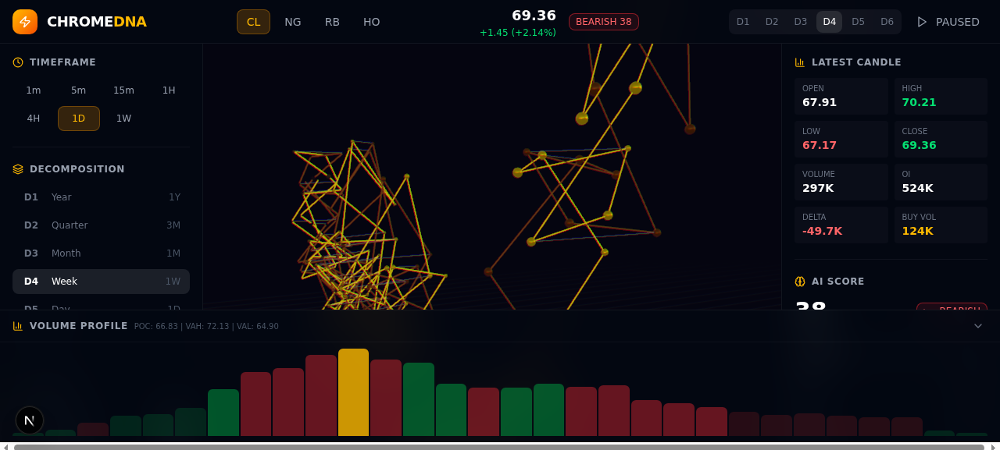

<p align="center">
  
</p>

<h1 align="center">CHROME DNA <span style="color: #f59e0b">Energy Edition</span></h1>

<p align="center">
  <strong>3D-визуализация рынка энергоносителей</strong><br/>
  Crude Oil · Natural Gas · RBOB Gasoline · Heating Oil
</p>

<p align="center">
  
  
  
  
  
</p>

---

## О проекте

**CHROME DNA Energy Edition** — интерактивный 3D-терминал визуализации рынка энергоносителей. Данные отображаются в виде двойной ДНК-спирали, где **ось Y = цена**, **ось Z = время**, а **масштаб узлов = объём**. Покупатели и продавцы закручены вокруг общей оси, формируя интуитивно понятную картину баланса рыночных сил.



## Ключевые возможности

### 3D-визуализация (12+ слоёв)

| Слой | Описание |
|------|----------|
| 🔬 **DNA-спираль** | Двойная спираль с TubeGeometry-backbone (покупатели=золото, продавцы=медь) |
| 🌐 **Голографический пол** | Сетка с GLSL-шейдером радиального свечения |
| 💍 **Кольца выбора** | Подсветка активной свечи с вертикальными лучами |
| 📊 **Плоскости цен** | Полупрозрачные плоскости на уровнях Current/High/Low |
| ✨ **Частицы-трейл** | 40 светящихся частиц за последними узлами спирали |
| 🌊 **Поток данных** | 30 частиц, путешествующих вдоль спирали |
| 🌀 **Объемная тепловая карта** | Торы вокруг спирали, масштабированные по объёму |
| 🔔 **EIA-маркеры** | Кольца на свечах среды (данные EIA) |
| 📐 **Уровни Фибоначчи** | Оверлей с ключевыми уровнями |
| 🌧 **Частицы погоды** | Визуализация влияния погодных условий |
| 💫 **Ambient Glow Ring** | Пульсирующий тор в центре спирали |
| ⭐ **Starfield** | 200+ плавающих ambient-частиц + звёздное поле |

Пост-обработка: **Bloom**, **ChromaticAberration**, **Vignette**

### Панели и инструменты (17+ панелей)

**Header:**
- Переключение символов (CL / NG / RB / HO)
- Живая цена + мини-спарклайн
- BID / ASK спред с анимацией
- EIA обратный отсчёт
- AI Composite Score бейдж
- LIVE-режим с heartbeat-анимацией

**Left Panel:**
- Таймфреймы (1m — 1M)
- Декомпозиция (D1–D6: Year → Tick)
- Переключатели слоёв (7 слоёв)
- Market Pulse
- Управление камерой
- Price Alerts (выше/ниже с триггерами)
- Trade Simulation (BUY/SELL, P&L, equity curve)
- Scene Info

**Right Panel:**
- Candle Details
- AI Composite Score (7 компонентов)
- Technical Indicators: RSI, MACD, Bollinger Bands, ATR
- Order Flow
- Risk Calculator (position sizing)
- Performance Heatmap Calendar (GitHub-style)
- Watchlist (4 символа мини-карточки)
- Market Regime Indicator (Trending/Ranging/Volatile/Quiet)
- Correlation Matrix

**Bottom Panel:**
- Volume Profile с POC / VAH / VAL
- Delta Distribution
- Cumulative Delta Trend

**Дополнительно:**
- EIA Report Overlay
- Help Modal (все шорткаты)
- Screenshot Export ([S] → PNG)
- Notification Center
- Live Ticker
- Playback Bar (исторический повтор)
- Sentiment Gauge

### Клавиатурные шорткаты

| Клавиша | Действие |
|---------|----------|
| `1` `2` `3` `4` | Переключить символ: CL / NG / RB / HO |
| `[` / `]` / `\` | Левая / Правая / Нижняя панель |
| `S` | Скриншот (PNG) |
| `E` | EIA Report Overlay |
| `P` | Playback Bar |
| `R` | Авто-вращение камеры |
| `F` | Уровни Фибоначчи |
| `L` | LIVE-режим |
| `?` | Справка |

## Технологический стек

| Категория | Технология |
|-----------|-----------|
| **Фреймворк** | Next.js 16 + App Router |
| **Язык** | TypeScript 5 |
| **3D-рендеринг** | React Three Fiber + Drei + @react-three/postprocessing |
| **Состояние** | Zustand (4 stores: market, ui, trade, playback) |
| **Стилизация** | Tailwind CSS 4 + shadcn/ui + 1445 строк custom CSS |
| **Анимации** | Framer Motion + CSS keyframes (20+ кастомных) |
| **Иконки** | Lucide React |
| **База данных** | Prisma ORM (SQLite, доступна) |

## Установка и запуск

### Требования

- **Node.js** ≥ 18 или **Bun** ≥ 1.0
- **npm** или **bun**

### Установка

```bash
# Клонировать репозиторий
git clone https://github.com/stsgs1980/CHROMEDNA.git
cd CHROMEDNA

# Установить зависимости
npm install
# или
bun install
```

### Разработка

```bash
npm run dev
# или
bun run dev
```

Приложение будет доступно на **http://localhost:3000**

> ⚠️ **Важно:** Dev-сервер Next.js потребляет значительный объём памяти (~1.3 GB) при компиляции 3D-компонентов. В resource-constrained средах используйте production-режим.

### Production-режим (рекомендуется)

```bash
# Сборка
npm run build

# Запуск
npm run start
# или с ограничением памяти:
NODE_OPTIONS="--max-old-space-size=512" npm run start
```

Production-режим использует **~250 MB RAM** vs **~1.5 GB** в dev-режиме.

### Линтинг

```bash
npm run lint
```

## Архитектура проекта

```
src/
├── app/
│   ├── page.tsx              # Главная страница + layout + DataLoader
│   ├── layout.tsx            # Root layout + providers
│   ├── globals.css           # 1445 строк CSS + анимации
│   └── api/market/           # API routes (data, score)
│
├── components/
│   ├── canvas/               # 3D-сцена
│   │   ├── Scene.tsx         # Композиция + пост-обработка (559 строк)
│   │   ├── EnergyHelix.tsx   # DNA-спираль (1030 строк)
│   │   ├── CameraRig.tsx     # Управление камерой
│   │   └── LiveTickSimulator.tsx  # Генерация тиков
│   │
│   └── panels/               # UI-панели
│       ├── Header.tsx        # Заголовок с ценой + спредом
│       ├── LeftPanel.tsx     # Таймфреймы + декомпозиция + alerts
│       ├── RightPanel.tsx    # Индикаторы + AI + heatmap
│       ├── BottomPanel.tsx   # Volume Profile + Delta
│       ├── TradeSimulation.tsx   # Симулятор торговли
│       ├── RiskCalculator.tsx    # Калькулятор рисков
│       ├── PerformanceHeatmap.tsx # Тепловая карта P&L
│       ├── SentimentGauge.tsx    # Индикатор настроений
│       ├── Watchlist.tsx         # Список наблюдения
│       ├── PriceAlerts.tsx       # Ценовые алерты
│       ├── EIAReportOverlay.tsx  # EIA отчёт
│       ├── NotificationCenter.tsx # Уведомления
│       ├── PlaybackBar.tsx       # Воспроизведение истории
│       ├── LiveTicker.tsx        # Бегущая строка
│       ├── HelpModal.tsx         # Модальное окно помощи
│       └── ScreenshotExport.tsx  # Экспорт скриншотов
│
├── stores/                   # Zustand state management
│   ├── marketStore.ts        # Рыночные данные + alerts
│   ├── uiStore.ts            # UI-состояние (панели, слои)
│   ├── tradeStore.ts         # Симуляция торговли
│   └── playbackStore.ts      # Воспроизведение
│
├── lib/                      # Библиотеки и утилиты
│   ├── aiScoring.ts          # AI Composite Score (7 компонентов)
│   ├── energyGenerators.ts   # Генераторы моковых данных
│   ├── helixMath.ts          # Математика спирали
│   └── db.ts                 # Prisma client
│
└── types/                    # TypeScript типы
    ├── energy.ts             # EnergySymbol, DecompositionLevel, etc.
    └── market.ts             # Candle, VolumeProfile, OrderFlow, etc.
```

## Рыночные инструменты

| Символ | Название | Базовая цена | Волатильность | Единица |
|--------|----------|-------------|---------------|---------|
| **CL** | Crude Oil Light Sweet | $75.00 | 2.5% | $/bbl |
| **NG** | Natural Gas | $3.00 | 4.5% | $/MMBtu |
| **RB** | RBOB Gasoline | $2.50 | 2.0% | $/gal |
| **HO** | Heating Oil | $2.30 | 2.2% | $/gal |

## Данные

В текущей версии используются **моковые данные** (генератор `energyGenerators.ts`). Для production-интеграции требуется подключение к реальным источникам:

- **CME Group** — фьючерсные данные
- **EIA API** — еженедельные отчёты по запасам
- **WebSocket feeds** — real-time тики

## Стилизация

- **Палитра:** Amber / Gold / Green / Red (без indigo/blue)
- **Glassmorphism** панели с noise-текстурой
- **20+ кастомных CSS-анимаций:** heartbeat, radar-sweep, text-shimmer, traveling-light-dot, pulse-ring и др.
- **1445 строк** премиального CSS с микро-анимациями

## Известные ограничения

| Ограничение | Описание |
|-------------|----------|
| Моковые данные | Нет подключения к реальным рынкам |
| Нет Error Boundaries | Ошибка в 3D-компоненте крашит сцену |
| Монолитный CSS | 1445 строк в globals.css |
| Правая панель | 1184 строки в одном файле |
| Мобильная адаптация | Частичная, требуется 2D-fallback |

## Roadmap

- [ ] Интеграция реальных рыночных данных (CME, EIA API, WebSocket)
- [ ] Error Boundaries для 3D-компонентов
- [ ] Мобильная адаптация (2D-fallback режим)
- [ ] Декомпозиция RightPanel на подкомпоненты
- [ ] CSS-модули вместо монолитного globals.css
- [ ] Unit-тесты (Vitest)
- [ ] Мульти-таймфрейм сравнение
- [ ] AI-powered распознавание паттернов
- [ ] Supply chain overlay на 3D-сцене

## Лицензия

Private. Все права защищены.

---

<p align="center">
  <sub>Built with Next.js · React Three Fiber · Zustand · Tailwind CSS</sub>
</p>
